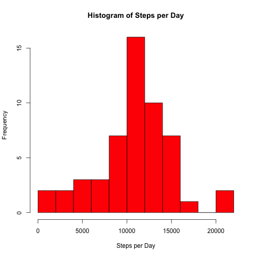
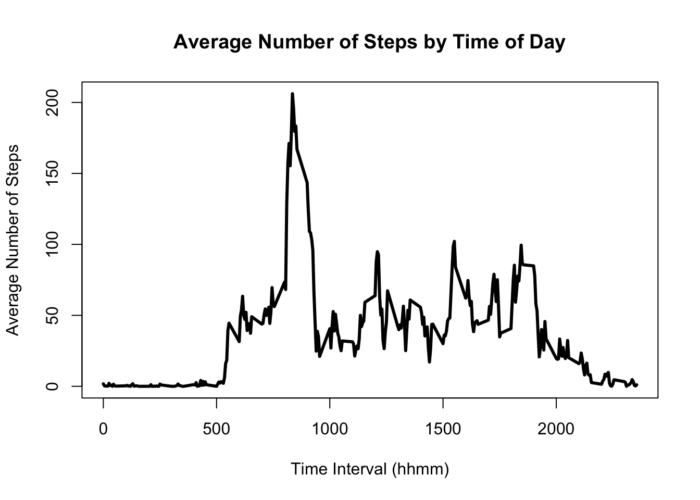
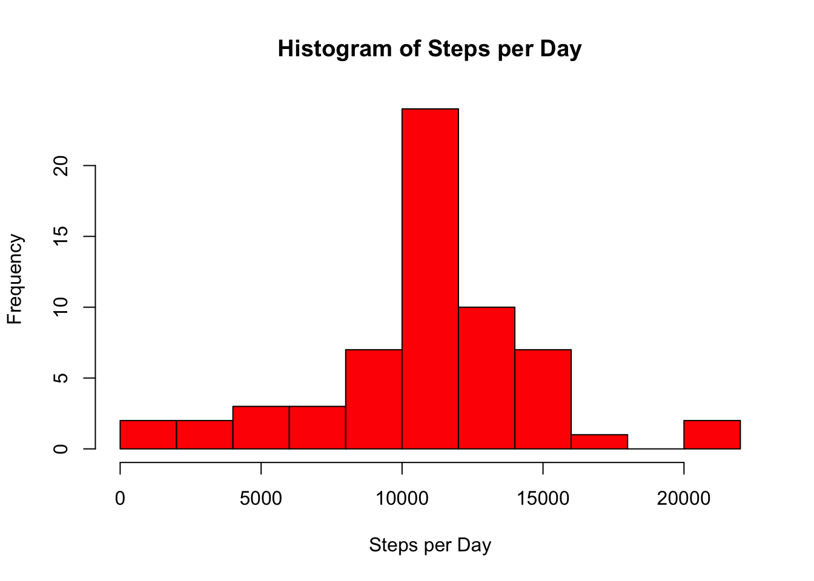
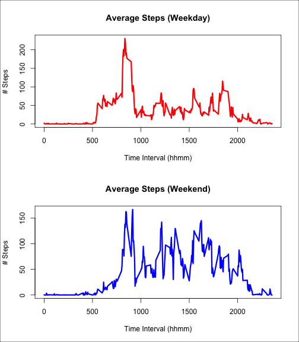
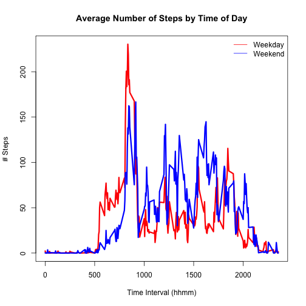

## Loading and preprocessing the data

First, let's extract activity.csv from activity.zip, if we haven't already done
so, and read the data into R.


```
##     steps       date interval
## 283    NA 2012-10-01     2330
## 284    NA 2012-10-01     2335
## 285    NA 2012-10-01     2340
## 286    NA 2012-10-01     2345
## 287    NA 2012-10-01     2350
## 288    NA 2012-10-01     2355
## 289     0 2012-10-02        0
## 290     0 2012-10-02        5
## 291     0 2012-10-02       10
## 292     0 2012-10-02       15
```

From the example rows above, it looks like our data consists of the number of
steps, followed by a date, then the start time of a 5 minute interval in the
form hhmm.  Let's make sure that date is in a date format that R can recognize.


Finally, let's subset away the data that is missing (NA).


## What is mean total number of steps taken per day?

Here we compute the total number of steps taken each day, and display the results
in a histogram.

 

```
## [1] 10766.19
```

```
## [1] 10765
```

In this data set, the mean number of steps taken per day is
10766.19 and the median is 10765.

## What is the average daily activity pattern?

Let us compute the average number of steps taken during each time interval, and 
display the results as a time-series plot.

 

```
## [1] 206.1698
```

```
## [1] "835"
```

For this data set, the subject is most active between 8:35 and 8:40, with an average 206.17 steps in that interval.

## Inputting missing values

It looks like the missing values always seem to cover days.  So we can fill them
in if we assume that the subject's activity level was comparable to other days
for which we do have data, and that they simply neglected to turn their monitor
on.  To this end, let's use the mean for each time interval to fill in the data
for the missing days.

First, let's try to verify our assertion.


```
## [1] 2304
```

```
## [1] 8
```

So we have 2304 missing values, spread out over 8
days.  Each day consists of 24x12 = 288 five-minute periods, so 8
missing days would give us 288x8=2304 missing values.
This tells us that only complete days are missing, since if one day had fewer than
288 missing values, another day would have to have more, which is not possible.

So let's fill in the missing values using the mean for each interval.  First, 
we copy our data into a new data set.  Then we add a column to the table for the
interval mean, then replace the value of 'steps' with the value in 'intervalMean'
whenever 'steps' is NA.

 

```
## [1] 10766.19
```

```
## [1] 10766.19
```

Using this reconstruction, the mean number of steps per day is unchanged, but the
median has become the mean.  The histogram distribution is almost the same, except
that the bin containing the mean has become more frequent, since we decided to 
classify all days where we had no data as 'average' days.

## Are there differences in activity patterns between weekdays and weekends?

To see the difference in activity between weekdays and weekends, first we make a
new column initialized to the factor "weekday", and set any observation
taken on Saturday and Sunday to "weekend"


Now that we can tell the weekdays from the weekends, let's make a time-series plot for each factor, and compare the activity levels.

 

It looks like there is some difference in activity level between weekdays and
weekends.  To better illustrate this let's plot these time-series together on
one set of axes.

 

It appears that the subject makes a point to do some walking in the morning
around 8:30am on weekdays and weekends.  However, they move more consistently on weekends throughout the day, whereas on weekdays the steps are more concentrated
in the morning and afternoon.  This could be explained by the subject being at
work or school during the day on weekdays.
